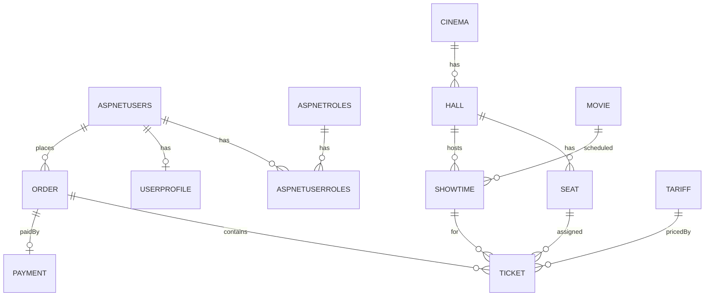

# Проект БД: продажа и бронирование билетов кинотеатра

Ниже представлен проект структуры базы данных и связей для веб-приложения продажи и
бронирования билетов кинотеатра. Документ включает: перечень сущностей, связи,
диаграмму вариантов использования и логическое проектирование (таблицы, ключи,
ограничения).

## Сущности и связи (кратко)

**Основные сущности**
- Пользователь (ASP.NET Core Identity / AspNetUsers)
- Роль (ASP.NET Core Identity / AspNetRoles)
- Кинотеатр (Cinema)
- Зал (Hall)
- Место (Seat)
- Фильм (Movie)
- Сеанс (Showtime)
- Цена/тариф (Tariff)
- Заказ (Order)
- Билет (Ticket)
- Оплата (Payment)
- Профиль пользователя (UserProfile, опционально)

**Ключевые связи**
- Cinema 1—M Hall
- Hall 1—M Seat
- Movie 1—M Showtime
- Hall 1—M Showtime
- Showtime 1—M Ticket
- AspNetUsers 1—M Order
- Order 1—M Ticket
- Order 1—1 Payment (оплата может быть отсутствовать для незавершенных заказов)
- Tariff 1—M Ticket
- AspNetRoles M—M AspNetUsers (через AspNetUserRoles)
- AspNetUsers 1—1 UserProfile (опционально)

## Диаграмма вариантов использования

```mermaid
usecaseDiagram
  actor "Гость" as Guest
  actor "Клиент" as Customer
  actor "Администратор" as Admin

  Guest --> (Просмотр афиши)
  Guest --> (Просмотр расписания)
  Guest --> (Поиск фильма)

  Customer --> (Регистрация/вход)
  Customer --> (Выбор сеанса)
  Customer --> (Выбор мест)
  Customer --> (Бронирование билетов)
  Customer --> (Оплата заказа)
  Customer --> (Просмотр своих билетов)
  Customer --> (Отмена бронирования)

  Admin --> (Управление фильмами)
  Admin --> (Управление залами и местами)
  Admin --> (Управление расписанием)
  Admin --> (Управление тарифами)
  Admin --> (Управление промокодами)
  Admin --> (Просмотр продаж)
```

## Логическое проектирование (таблицы и ключи)

Ниже предложена логическая модель для SQL Server (типизация примерная; можно
адаптировать под иной СУБД).

### Пользователи и роли (ASP.NET Core Identity)

Ниже приведены ключевые таблицы Identity (минимально необходимое).

**AspNetUsers**
- Id (PK, nvarchar(450))
- UserName (nvarchar(256), unique, null)
- NormalizedUserName (nvarchar(256), unique, null)
- Email (nvarchar(256), null)
- NormalizedEmail (nvarchar(256), null)
- EmailConfirmed (bit, not null)
- PasswordHash (nvarchar(max), null)
- PhoneNumber (nvarchar(32), null)
- PhoneNumberConfirmed (bit, not null)
- TwoFactorEnabled (bit, not null)
- LockoutEnd (datetimeoffset, null)
- LockoutEnabled (bit, not null)
- AccessFailedCount (int, not null)

**AspNetRoles**
- Id (PK, nvarchar(450))
- Name (nvarchar(256), unique, null)
- NormalizedName (nvarchar(256), unique, null)
- ConcurrencyStamp (nvarchar(max), null)

**AspNetUserRoles**
- UserId (FK -> AspNetUsers.Id)
- RoleId (FK -> AspNetRoles.Id)
- PK (UserId, RoleId)

**AspNetUserClaims**
- Id (PK, int, identity)
- UserId (FK -> AspNetUsers.Id)
- ClaimType (nvarchar(max), null)
- ClaimValue (nvarchar(max), null)

**AspNetUserLogins**
- LoginProvider (nvarchar(128))
- ProviderKey (nvarchar(128))
- ProviderDisplayName (nvarchar(max), null)
- UserId (FK -> AspNetUsers.Id)
- PK (LoginProvider, ProviderKey)

**AspNetUserTokens**
- UserId (FK -> AspNetUsers.Id)
- LoginProvider (nvarchar(128))
- Name (nvarchar(128))
- Value (nvarchar(max), null)
- PK (UserId, LoginProvider, Name)

**AspNetRoleClaims**
- Id (PK, int, identity)
- RoleId (FK -> AspNetRoles.Id)
- ClaimType (nvarchar(max), null)
- ClaimValue (nvarchar(max), null)

**UserProfile (опционально)**
- UserId (PK, FK -> AspNetUsers.Id)
- FullName (nvarchar(128), null)
- CreatedAt (datetime2, not null)
- IsActive (bit, not null)

### Кинотеатры, залы, места

**Cinema**
- CinemaId (PK, int, identity)
- Name (nvarchar(128), not null)
- Address (nvarchar(256), not null)
- City (nvarchar(64), not null)
- Phone (nvarchar(32), null)
- IsActive (bit, not null)

**Hall**
- HallId (PK, int, identity)
- CinemaId (FK -> Cinema.CinemaId)
- Name (nvarchar(64), not null)
- Rows (int, not null)
- SeatsPerRow (int, not null)
- IsActive (bit, not null)

**Seat**
- SeatId (PK, int, identity)
- HallId (FK -> Hall.HallId)
- RowNumber (int, not null)
- SeatNumber (int, not null)
- SeatType (nvarchar(32), not null) // standard/vip/etc
- IsActive (bit, not null)
- Unique (HallId, RowNumber, SeatNumber)

### Фильмы и сеансы

**Movie**
- MovieId (PK, int, identity)
- Title (nvarchar(256), not null)
- Description (nvarchar(max), null)
- DurationMinutes (int, not null)
- AgeRating (nvarchar(16), null)
- ReleaseDate (date, null)
- PosterUrl (nvarchar(512), null)
- IsActive (bit, not null)

**Showtime**
- ShowtimeId (PK, int, identity)
- MovieId (FK -> Movie.MovieId)
- HallId (FK -> Hall.HallId)
- StartAt (datetime2, not null)
- EndAt (datetime2, not null)
- BasePrice (decimal(10,2), not null)
- Status (nvarchar(32), not null) // scheduled/cancelled

### Тарифы и цены

**Tariff**
- TariffId (PK, int, identity)
- Name (nvarchar(64), not null)
- PriceModifier (decimal(10,2), not null) // надбавка/скидка
- Description (nvarchar(256), null)
- IsActive (bit, not null)

### Заказы, билеты, оплата

**Order**
- OrderId (PK, uniqueidentifier)
- UserId (FK -> AspNetUsers.Id)
- Status (nvarchar(32), not null) // reserved/paid/cancelled/expired
- TotalAmount (decimal(10,2), not null)
- ReservedAt (datetime2, not null)
- ExpiresAt (datetime2, null)

**Ticket**
- TicketId (PK, uniqueidentifier)
- OrderId (FK -> Order.OrderId)
- ShowtimeId (FK -> Showtime.ShowtimeId)
- SeatId (FK -> Seat.SeatId)
- TariffId (FK -> Tariff.TariffId)
- Price (decimal(10,2), not null)
- Status (nvarchar(32), not null) // reserved/paid/cancelled
- Unique (ShowtimeId, SeatId)

**Payment**
- PaymentId (PK, uniqueidentifier)
- OrderId (FK -> Order.OrderId, unique)
- Provider (nvarchar(64), not null)
- Amount (decimal(10,2), not null)
- PaidAt (datetime2, null)
- Status (nvarchar(32), not null) // pending/success/failed
- ExternalRef (nvarchar(128), null)

## Дополнительные правила и ограничения

- На один сеанс одно место может быть продано/забронировано только один раз
  (уникальность Ticket: ShowtimeId + SeatId).
- Заказ может иметь множество билетов, но только один платеж.
- Бронирование имеет срок жизни (ExpiresAt) и может быть помечено как expired.
- Стоимость билета = Showtime.BasePrice + Tariff.PriceModifier.
- Запретить пересечение сеансов в одном зале:
  уникальность по (HallId, StartAt) и проверка на пересечения при создании сеанса.

## Краткая диаграмма логических связей (ERD-представление)


